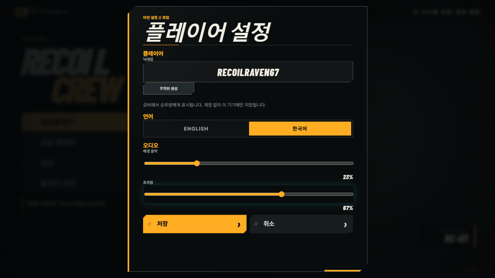
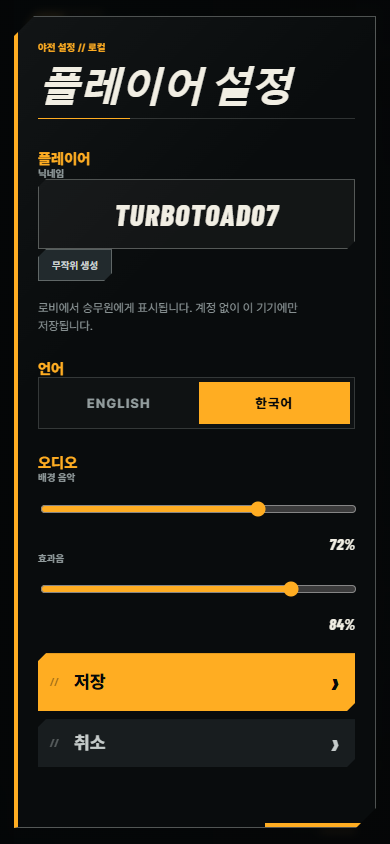

# Localization, Copy, and Settings V2 — Implementation Report

Date: 2026-08-10
Branch: `feature/final-localization-settings-copy`
Main-derived base SHA: `4fd9af32605b04d8ff95f7d11bffc4c72885a988`
Ending product SHA: `0aa6773e4b0c21c2cd95062e076acfe6176804bb`

## Delivered

- Added runtime `en`/`ko` catalogs with fallback, interpolation, interpolation-token parity, subscriptions, and `html[lang]` synchronization.
- Added key-aware scene fields (`textKey`, `placeholderKey`, `titleKey`, `ariaLabelKey`) and localized binding formats. Cached scene, lobby, reward, tactical, HUD, and relic accessibility surfaces refresh after a locale change.
- Cleaned the presentation copy for 28 relics, 18 upgrade categories, and 57 enemy definitions. Technical labels such as `High Detail`, `clamp 0`, and `two stacks: 0` no longer appear as player copy. Upgrade effects continue to use structured stat presentation and combat display units.
- Added semantic result `titleId` values and client-side error-code resolution so current network presentation is language-neutral while retaining legacy English fields as compatibility fallbacks.
- Added Settings V2 with an accessible language radiogroup and native BGM/SFX range controls. Preview is immediate; Save persists the full V2 record; Cancel restores the saved locale and both gains.
- Added independent user gain stages and a perceptual `x²` volume curve. Gain changes use 30 ms Web Audio ramps and muting BGM does not pause or reset its media timeline.

## Catalog and literal audit

The machine-readable audit is [PLAYER_FACING_LITERAL_INVENTORY.json](./PLAYER_FACING_LITERAL_INVENTORY.json), generated with:

```text
npm run audit:localization
```

| Measure | Count |
| --- | ---: |
| English keys | 460 |
| Korean keys | 460 |
| Missing Korean keys | 0 |
| Extra Korean keys | 0 |
| Audited authored literals | 317 |
| Authored literals with direct key metadata | 99 |

The localization workstream supplied 453 paired catalog keys. The integrated
Machine Gun and phase-announcement workstreams added seven paired domain keys,
bringing the final catalogs to 460 keys with full English/Korean parity.

Untranslated exceptions are deliberate language-neutral material: the `RECOIL CREW` mark, `RC` unit marks, keyboard/mouse glyphs, numbers, player nicknames, room codes, and user-authored chat. Scene/editor labels and preview fixture values are not shipped presentation copy. Internal content IDs remain in data and network payloads but are resolved to catalog copy before display.

## Font and license

Korean UI uses `pretendard@1.3.9`, imported through its variable dynamic-subset stylesheet. The package provides Unicode-ranged WOFF2 subsets and uses `font-display: swap`; CSS falls back to `Noto Sans KR`, then the system sans-serif stack. Pretendard is licensed under the SIL Open Font License 1.1.

Attribution and the upstream license reference are recorded in [THIRD_PARTY_FONT_NOTICE.md](./THIRD_PARTY_FONT_NOTICE.md). The production build verified that the Pretendard subset files are emitted.

## Settings migration and persistence

- V1 key: `recoilCrew.playerSettings.v1`
- V2 key: `recoilCrew.playerSettings.v2`
- V1 migration preserves the validated nickname, derives `en`/`ko` from the browser language, and initializes BGM/SFX to 100.
- V2 parsing validates the nickname and locale and clamps finite volume values to integer `0..100`.
- Corrupt JSON, invalid records, unavailable storage, and read/write exceptions recover to safe defaults with an in-memory fallback.
- Draft ownership is explicit: `beginEdit` snapshots saved state, preview changes only the draft plus live services, Save normalizes/persists, and Cancel restores saved state.

## Audio graph

```text
Soundtrack media
  → track fade → low-pass → context gain → duck gain
  → BGM user gain → master → compressor → destination

Authored procedural category buses
  → authored SFX mix bus → SFX user gain
  → master → compressor → destination
```

The user gain nodes are downstream of soundtrack context/duck automation and the authored SFX mix, so neither slider overwrites authored balance or soundtrack state automation.

## Extension seams and ownership

- New domains add matching JSON keys under `content/locales/en` and `content/locales/ko`; catalog parity tests fail if either side is incomplete or interpolation tokens differ.
- Runtime callers use semantic IDs plus an authored fallback. `contentKeys.ts` centralizes content-ID-to-key conversion without putting language on the wire.
- Network errors resolve from semantic `code`; results resolve from semantic `titleId`; enemy, relic, and upgrade presentation resolve from existing content IDs.
- The later Machine Gun, Landing, and Announcement workstreams own their final domain keys and presentation behavior. They can subscribe to `LocalizationService` and add domain catalogs without changing Settings or the transport. This workstream does not implement those mechanics or announcement presentation.

## Verification

Passed:

- `npx tsc --noEmit`
- `npm run build` (client, generated presentation/content packs, Vite production bundle, and server bundle)
- Focused localization/settings/audio tests: 14/14
- Affected presentation, HUD, settings, results, and mode suites: 87/87 and 51/51
- `npm run test:localization:e2e`: 2/2 in Chromium on isolated port 8109
  - runtime English→Korean refresh
  - Cancel restoration
  - V2 Save/reload persistence
  - independent BGM/SFX values
  - desktop 1280×720 and Korean mobile 390×844 viewport containment

`npm test` was run. The localization/settings/copy/audio tests pass, while 10 unrelated tests in the shared dirty checkout remain red: predictor replay (2), Double Barrel charge scaling, jump replay, XP shard cleanup, demo golden fixture, asset-manifest fixture, the excluded fall-removal/Ground Pound content assertion, and two Monsterpack importer tests requiring a missing local ZIP. These failures are outside this workstream and were not changed or masked.

## Screenshots

Desktop Korean Settings V2:



Mobile Korean Settings V2 after scrolling to the action area:



## Explicit exclusions

No fullscreen control, in-match chat feature, Machine Gun mechanics/balance, Ground Pound mechanics/formulas, landing mechanics, arena-boundary changes, or phase-banner presentation was added by this workstream.
