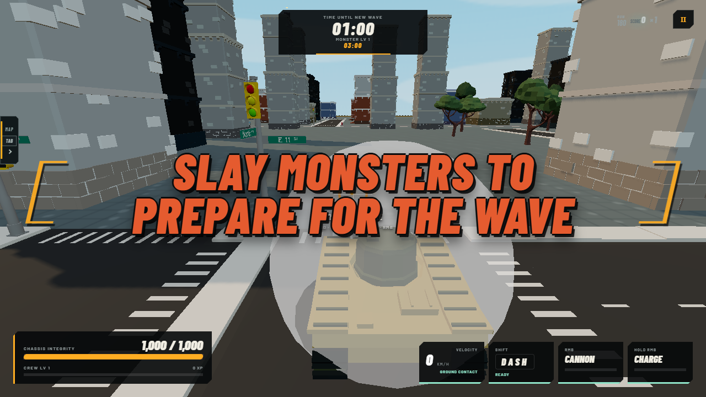
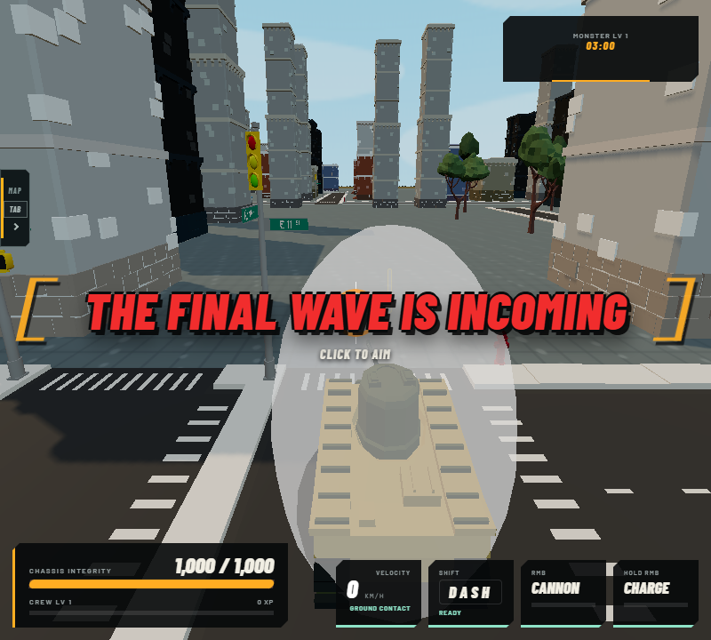
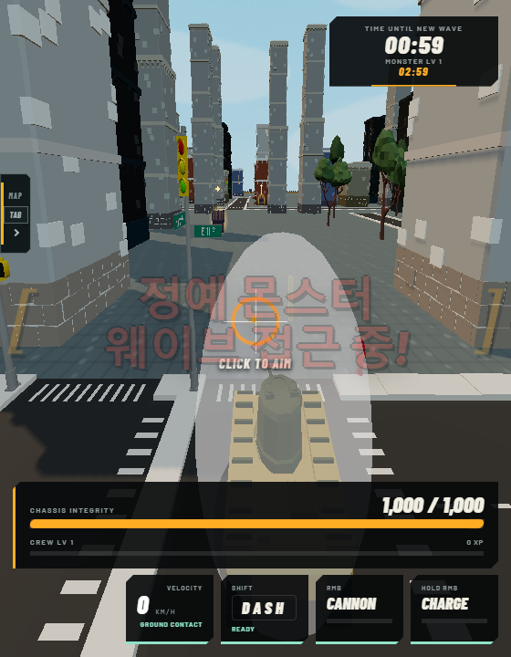
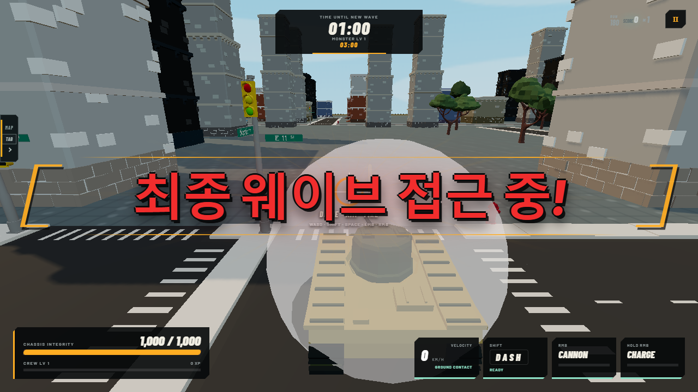

# Final Workstream 5 — Phase Announcement Implementation Report

## Build record

- Branch: `feature/final-phase-announcements`
- Starting SHA: `4fd9af32605b04d8ff95f7d11bffc4c72885a988`
- Ending product SHA after the required integration rebase: `e5eb91b47b58f9a140b9b34479025f7b2eca5f0f`
- Final branch/report SHA: `6db3c5a5a6f98fc3945c82be9a1134f9c72a6bbc`
- Binding design: `PHASE_ANNOUNCEMENT_BANNERS_DESIGN.md`
- Audit scope: `src/shared/stage/`, `src/shared/horde/`, the client HUD and UI paths, `presentationEventRouter.ts`, procedural and soundtrack audio, `content/horde/stageSequenceProduction.json`, and the current EN/KO localization catalogs.

The production stage sequence remains the sole phase authority. `presentationEventRouter.ts` was audited but is intentionally not the trigger source: phase state arrives in snapshots, while replaying a presentation event on reconnect would violate the no-replay requirement.

## Trigger logic

`HordeStageView` now carries the StageDirector's monotonic `phaseSequence`. `stageViewForMatch()` copies it directly from authoritative stage state, and the HUD's isolated `PhaseAnnouncementLayer` observes `(matchId, phaseSequence, phase)`.

| Authoritative phase | Announcement | Intensity | Camera impulse |
| --- | --- | ---: | ---: |
| `farming1`, `farming2`, `farming3` | `phase.farming` | 0.75 | 0.16 |
| `wave1`, `wave2` | `phase.elite` | 1.00 | 0.34 |
| `bossWave` | `phase.final` | 1.25 | 0.58 |

Rules:

- A strictly newer `phaseSequence` produces at most one banner.
- Repeated snapshots at the same sequence do not replay presentation or audio.
- Fresh single-player and online starts prime sequence `-1`, so sequence `0` is announced.
- Reconnect/resume starts without an initial announcement and silently baselines the first received sequence.
- A new `matchId`/rematch resets the gate, so its genuine sequence `0` is announced.
- Sequence regression is baselined defensively and never replays an old banner.
- Gameplay continues throughout; the layer owns no simulation state.

## Presenter and motion

The presenter is isolated in `src/client/presentation/phaseAnnouncementLayer.ts`. It mounts one fixed, center-screen semantic live region with `pointer-events: none` in both CSS and its inline safety property. The banner does not pause gameplay or install input handlers.

Total display time is **1,550 ms**:

- 0–170 ms: scale/blur slam from 1.35 toward 1.0, with streak and rail construction.
- Approximately 170–1,054 ms: readable centered hold.
- Approximately 1,054–1,550 ms: slight upward exit and fade.

Reduced-motion mode removes slam, transform, streak, rail, blur, and full camera shake while retaining a 1,550 ms opacity-only readable hold. Camera impulse is multiplied by 0.28 and remains capped at 0.7.

The heading uses `clamp(29.4px, 5.04vw, 75.6px)`, Barlow Condensed 900 italic for English, a matte near-black multi-edge outline/shadow, crimson or warning-orange accents, a pale highlight, amber industrial brackets, and a transparent radial/conic impact streak instead of an opaque panel. Korean switches to the localized display font, upright 900 weight, tighter measured tracking, `word-break: keep-all`, and a narrower responsive size. The 560 px breakpoint preserves safe margins and two-line layout.

While active, the legacy `.hud-wave-warning` and `.hud-phase-label` are hidden to prevent duplicate phase messaging. Encounter/leader bars remain visible.

## Localization

Only the required keys were added through the current per-locale JSON catalog convention:

| Key | English | Korean |
| --- | --- | --- |
| `phase.farming` | SLAY MONSTERS TO PREPARE FOR THE WAVE | 몬스터를 처치해 웨이브에 대비하라! |
| `phase.elite` | ELITE MONSTER WAVE INCOMING | 엘리트 몬스터 웨이브 접근 중! |
| `phase.final` | THE FINAL WAVE IS INCOMING | 최종 웨이브 접근 중! |

The presenter requests semantic keys from the runtime localization service; it contains no hardcoded English presentation path. An active banner can refresh when the runtime locale changes without replaying its audiovisual impact.

## Original procedural sound and music behavior

`phaseAnnouncementImpact` is a new local `uiReward` procedural recipe (priority 96, 0.68 s, non-positional, 0.08 reverb send). It is synthesized from:

- THUMP: 84 Hz → 35 Hz over 0.38 s;
- CRACK: 2,150 Hz → 470 Hz over 0.12 s;
- RUMBLE: 64 Hz → 29 Hz over 0.56 s;
- AIR: 1,350 Hz → 125 Hz over 0.46 s;
- restrained METAL partials at 410, 690, and 1,080 Hz over 0.19 s.

All layer gains scale with the authored 0.75/1.00/1.25 phase intensity. No sample is imported or bundled.

The existing independent soundtrack automation receives a 20% duck with 20 ms attack, 150 ms hold, and 430 ms release. It does not restart or change the current track/context. The SFX and BGM user gain stages are not written or replaced.

## Browser qualification screenshots

All screenshots were generated by `e2e/phase-announcements.spec.ts` against the built application and visually inspected for centering, clipping, localized typography, HUD coexistence, and readability.

## Test matrix

| Command / suite | Result | Coverage or note |
| --- | --- | --- |
| `npx tsc --noEmit` | PASS | Type contract, including replicated `phaseSequence`. |
| `npm run build` | PASS | Presentation/content generation, Vite client, and bundled server. |
| `tests/presentation/phaseAnnouncementLayer.test.ts` | PASS — 7/7 | Six-phase mapping, once-only sequence, reconnect, rematch, EN/KO refresh, pointer safety, timer, reduced motion, duplicate-HUD CSS. |
| `tests/coreloop06/stageDirector.test.ts` | PASS — 12/12 | Authoritative phase sequencing. |
| `tests/monsterStage.test.ts` | PASS — 22/22 | Replicated stage view includes the authoritative sequence. |
| `tests/audio` | PASS — 41/41 | Recipe metadata/layers plus soundtrack duck without track/context change. |
| `npx playwright test e2e/phase-announcements.spec.ts` | PASS — 2/2 | EN/KO, 1280/800/560 widths, bounds/no horizontal overflow, pointer safety, duplicate warning suppression, audio recipe, unchanged soundtrack, reduced motion, screenshots. |
| `npm run test:presentation` | 73 pass, 3 fail outside this workstream | New phase presenter is 7/7. Concurrent localization/UI changes leave stale English-copy and segmented-control schema assertions in the broader suite. |
| Focused stage/horde/audio command | 194 pass, 6 fail outside this workstream | Stage authority, monster replication, and all audio tests pass. Six `hudStage` assertions currently receive empty strings for unrelated localization keys not added by this workstream. |
| `npm test` | RUN; exits 1 with 23 failures outside this workstream | The shared dirty worktree includes concurrent localization, boundary, movement/Ground Pound, progression/MG, and presentation edits, plus the environment lacks the optional MonsterPack import ZIP. No phase-announcement unit or browser test failed. |

## Exclusions and merge note

- No user-reference artwork, exact font treatment, animation, game asset, or sound was copied.
- The vine-boom sample and all other sampled audio are excluded.
- No soundtrack switch, restart, or user gain mutation was added.
- No mechanics, arena-boundary, machine-gun, Ground Pound, enemy, progression, or unrelated content behavior is part of this workstream.
- Generated content changes and unrelated dirty files visible in the shared worktree belong to other concurrent workstreams and are not claimed here.
- Per the binding plan, merge this workstream last, after localization and audio/VFX work, then rerun the full repository suite against that integrated baseline.

The resulting invariant is one brief, localized audiovisual punctuation mark for every genuine authoritative phase transition, with no replay on reconnect and no loss of player control.
