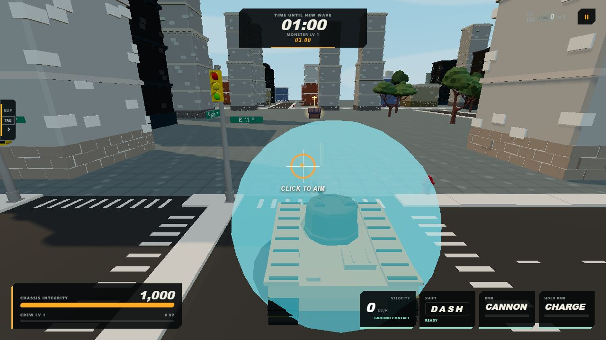
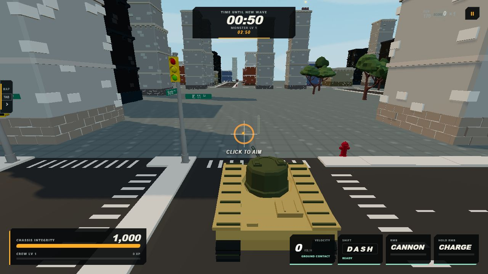
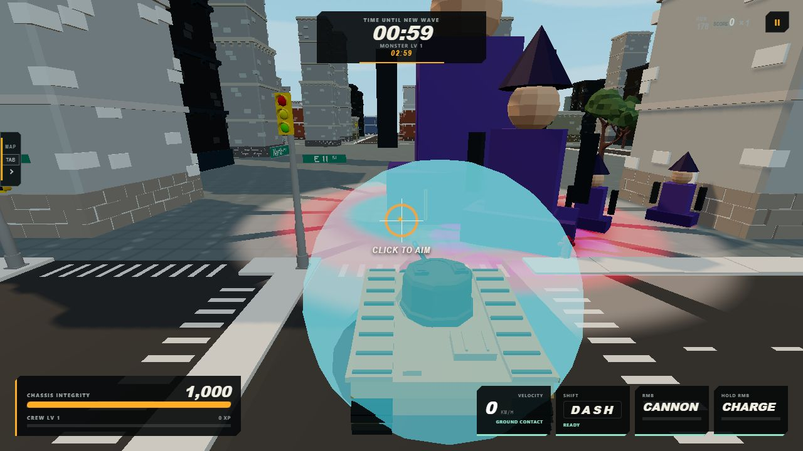
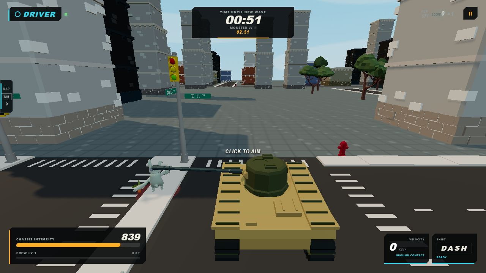
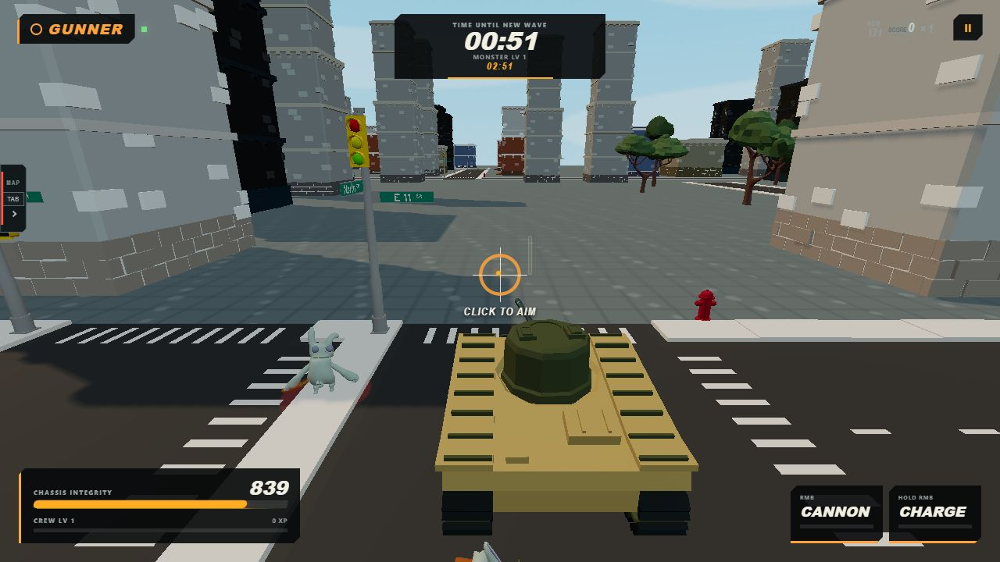
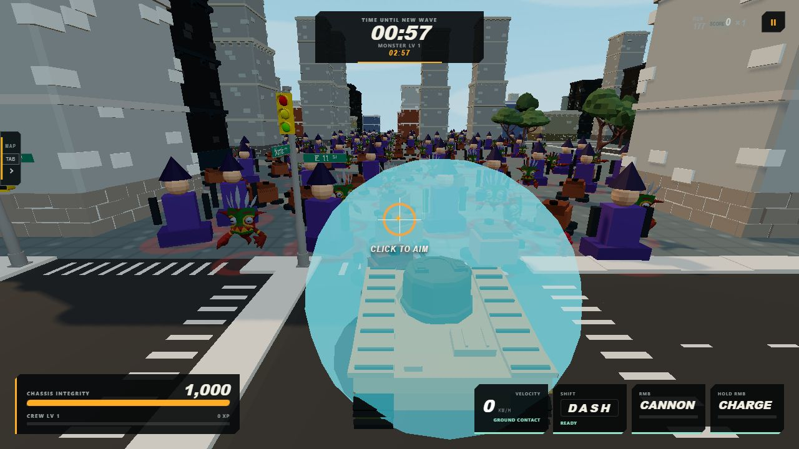

# Enemy Readability & Physical Scale V1 — Implementation Report

## Revision and scope

- Branch: `feature/enemy-readability-scale`
- Shared-base/start SHA: `47cb1e4b334c90ecd314fe98325954a7124a7668`
- `origin/main` at start: `47cb1e4b334c90ecd314fe98325954a7124a7668`
- End HEAD SHA at report time: `47cb1e4b334c90ecd314fe98325954a7124a7668`
- Delivery state: implementation is present as an uncommitted branch worktree diff; no commit was requested.
- Binding design source: local `main` commit `2e80f3916e06deccfa915e56f3087acf51ead218`. The named design file was not yet present in `origin/main` at the shared-base SHA.

The shared checkout was switched by concurrent workstreams during the audit, so implementation was isolated in a dedicated Git worktree attached to the requested branch. Unrelated deployment changes in the original checkout were not copied, edited, or staged.

## Implemented policy

`scripts/generate-monster-dimensions.ts` now emits the tier-aware size policy into `src/generated/monsterDimensions.generated.ts`. `monsterNormalization.ts` is the single runtime math authority that consumes it.

| Semantic tier | Small | Medium | Large | Rule |
| --- | ---: | ---: | ---: | --- |
| fodder/specialist | 1.20 m | 1.80 m | 2.00 m | exact clean ordinary target |
| elite baseline | 1.02 m | 1.53 m | 1.70 m | preserved before existing ×3 |
| boss baseline | 1.02 m | 1.53 m | 1.70 m | preserved before existing ×5 |

Preservation proof:

- Representative medium elite: `1.53 × 3 = 4.59 m` (unchanged).
- Representative large boss: `1.70 × 5 = 8.50 m` (unchanged).
- `readabilityScale` is `1` for elite/boss and approximately `1.176470588` for ordinary tiers.

The cache key now also includes `optionalVariantScale`, and every direct gameplay/socket caller passes that scale through.

## Physical parity proof

Representative resolved values from the generated source records and runtime resolver:

| Definition | Tier/size | H × W × D (m) | Collision R / H | Spawn clearance | Engagement R | Shadow R | Projectile socket |
| --- | --- | --- | --- | --- | --- | --- | --- |
| `enemy.quaternius.ninja` | fodder/small | 1.200 × 0.990 × 1.062 | 0.478 / 1.080 | 0.597 | 0.955 | 0.717 | `[0, 0.864, 0.425]` |
| `enemy.quaternius.tribal` | specialist/medium | 1.800 × 1.383 × 0.920 | 0.623 / 1.620 | 0.778 | 1.245 | 0.934 | `[0, 1.796, 0.368]` |
| `enemy.quaternius.dino` | specialist/large | 2.000 × 2.131 × 1.282 | 0.959 / 1.800 | 1.199 | 1.918 | 1.438 | `[0, 1.440, 0.513]` |
| `enemy.quaternius.alien-high-detail` | elite/medium | 4.590 × 4.406 × 2.206 | 1.983 / 4.131 | 2.479 | 3.966 | 2.974 | `[0, 3.305, 0.882]` |
| `enemy.quaternius.demon-high-detail` | boss/large | 8.500 × 10.566 × 5.759 | 4.755 / 7.650 | 5.943 | 9.509 | 7.132 | `[0, 6.120, 2.304]` |

Parity paths:

- Rendering and aggregate LOD use `finalScale` from `ResolvedMonsterDimensions`; no Three.js-only readability multiplier was added.
- MG ray hits use the exact resolved collision radius and collision height through an upright-cylinder intersection. Cannon projectile contact also respects vertical collision extent.
- Tank contact, obstacle resolution, knockback, splash, and relic contact continue through `EnemySystem.radiusFor`, which now delegates to `dimensionsFor`.
- Spawn formations apply each monster's `spawnClearanceRadius` in a deterministic no-overlap pass. Counts, budgets, and horde pressure are unchanged.
- Melee reservations and attack geometry use the resolved collision radius; authored attack reach remains a separate unchanged term.
- Projectile sockets are scaled by the same `finalScale`, including optional variant scale.
- World-UI anchor height is exported and derived from `finalHeight + 0.28 m`.
- Ground presence radius is derived from the same `shadowRadius`.

## Ground-presence renderer

One bounded renderer owns four fixed instanced layers:

- ordinary: stable dark-red `#9e332c` soft disc/broken ring;
- elite: violet `#b56cff` segmented ring;
- boss: crimson `#ff304d` ring plus restrained pale `#f3dfcf` segmented outer layer.

The renderer:

- classifies exact monster definition tier first, then shared semantic reward classification for legacy fallbacks;
- uses terrain `groundHeightAt`, a 0.035 m lift, and polygon offset;
- is depth tested, has `depthWrite: false`, and therefore does not overlay through buildings;
- fades ordinary from 45–90 m and specials from 45–120 m;
- uses per-instance alpha in one shader per fixed layer, with no DOM/Sprite allocation;
- caps total represented enemies at 512;
- disables the restrained boss scale pulse under reduced motion;
- resets counts on rematch and removes/disposes all marker meshes, geometry, and materials on client destruction.

## Files changed

Source/generation:

- `scripts/generate-monster-dimensions.ts`
- `src/generated/monsterDimensions.generated.ts`
- `src/shared/monsters/monsterNormalization.ts`
- `src/shared/enemies/enemyCollisionGeometry.ts`
- `src/shared/enemies/enemySystem.ts`
- `src/shared/enemies/enemyBehaviors.ts`
- `src/shared/projectiles/projectileSystem.ts`
- `src/shared/weapons/weaponBehaviors.ts`
- `src/shared/horde/spawnPlanner.ts`

Client presentation:

- `src/client/enemies/enemyGroundPresenceRenderer.ts`
- `src/client/app/entityViewRegistry.ts`
- `src/client/app/networkStatePresenter.ts`
- `src/client/app/gameClient.ts`
- `src/client/worldUi/enemyWorldUiLayer.ts`
- `src/client/main.ts` (test-only deterministic qualification fixture)

Tests/report:

- `tests/monsters/enemyReadabilityScale.test.ts`
- `tests/horde/enemyGroundPresenceRenderer.test.ts`
- `tests/monsterRosterValidation.test.ts`
- `tests/monsterStage.test.ts`
- `tests/monsters/groundingTransform.test.ts`
- `tests/monsters/scaleGrounding.test.ts`
- this report and the screenshot files below.

## Generation and automated verification

Actual generation command:

```text
npx tsx scripts/generate-monster-dimensions.ts
```

Result: `generated 45 dimension entries`.

| Check | Result |
| --- | --- |
| `npm run build` | PASS (client and server) |
| Monster + animation + horde focused run | PASS — 37 files, 302 tests |
| New renderer suite | PASS — includes 200 ordinary instances, semantic styles, terrain placement, depth policy, reduced motion, reset, and dispose |
| `npx tsc --noEmit` | Existing failure outside this workstream: six `ResolvedEnemyAudioProfile`/`Record<string, unknown>` errors in `presentationEventRouter.ts`, plus eight pre-existing union-narrowing errors in `tests/audio/proceduralSimulationEvents.test.ts` |
| `npm test` | Exits 1 with 10 unrelated/baseline-sensitive failures: predictor/replay expectations, relic reset, charge fixture, demo golden, asset-manifest baseline, a room timeout, and two missing local importer-ZIP checks. All scoped monster/animation/horde suites pass. |

## Browser qualification and performance

Browser checks used the production page in the in-app browser. All captured Single Player, Driver, Gunner, five-tier, and dense-fixture tabs had zero console errors.

| Scenario | Result |
| --- | --- |
| Narrow urban road, default camera | PASS |
| Small/medium/large ordinary | PASS via deterministic fixture (`ninja`, `tribal`, `dino`) |
| Elite/boss | PASS via deterministic fixture (`alien-high-detail`, `demon-high-detail`) |
| Single Player | PASS |
| Networked Driver + Gunner | PASS in a two-tab room; both role HUDs and shared enemies rendered |
| 100 ordinary, high quality | 41.33 measured FPS; render-submit p50 19.2 ms, p95 30.5 ms |
| 200 ordinary, high quality | 33.69 measured FPS; render-submit p50 28.4 ms, p95 33.2 ms |
| Ground layer microbenchmark, 200 instances × 300 frames | 0.1223 ms average CPU sync; four fixed draw calls |

The 100/200 browser fixture intentionally materializes full unique enemy rigs at close range, so whole-scene FPS is a worst-case stress result rather than marker-only cost. The presence renderer itself remains fixed at four draw calls and a sub-millisecond CPU update.

### Screenshots

The baseline and after images use the same default urban spawn/camera and post-countdown timing. Per-match monster-run seeding selected different ordinary identities, so they prove camera/road context but are not a same-identity pixel comparison.

Baseline:



After:



All representative tiers and semantic rings:



Two-client qualification:





Dense ordinary qualification:



## Exclusions confirmed

No production attack definitions, movement speeds, minimap behavior, progression values, horde counts/budgets, chat, chest beacons, global materials, global emissive policy, exposure, fog, multi-material handling, or full-screen outlines were changed. The only horde placement change is dimension-derived spawn separation; pressure and composition remain unchanged.
